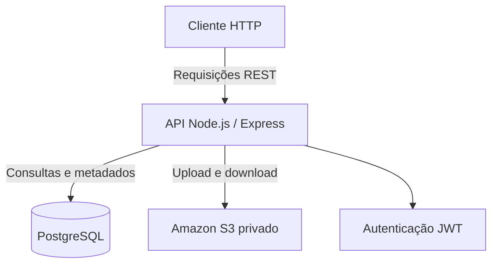

# CloudDocs

**API para gerenciamento seguro de documentos com Node.js, Express, PostgreSQL e Amazon S3.**

O CloudDocs é um projeto de portfólio desenvolvido para praticar a construção de APIs REST, autenticação de usuários, persistência de dados relacionais e integração com serviços de armazenamento em nuvem da AWS.

O projeto permite cadastrar usuários, autenticar requisições e gerenciar documentos armazenados no Amazon S3, mantendo seus metadados no PostgreSQL.

## Índice

* [Visão geral](#visão-geral)
* [Arquitetura](#arquitetura)
* [Tecnologias](#tecnologias)
* [Funcionalidades](#funcionalidades)
* [Estrutura do projeto](#estrutura-do-projeto)
* [Pré-requisitos](#pré-requisitos)
* [Configuração do ambiente](#configuração-do-ambiente)
* [Executando a API](#executando-a-api)
* [Endpoints](#endpoints)
* [Testes manuais](#testes-manuais)
* [Segurança](#segurança)
* [Status e próximos passos](#status-e-próximos-passos)

## Visão geral

O objetivo do CloudDocs é desenvolver uma API capaz de gerenciar documentos de forma organizada, associando cada arquivo ao usuário responsável e utilizando o Amazon S3 para armazenamento dos arquivos.

O projeto também serve como ambiente prático de aprendizagem sobre integração entre aplicação, banco de dados e serviços AWS.

## Arquitetura



### Fluxo de upload

1. O cliente envia um arquivo para a API.
2. A API valida a autenticação e recebe o arquivo.
3. O arquivo é enviado ao Amazon S3.
4. Os metadados e a referência ao objeto são armazenados no PostgreSQL.
5. A API retorna a resposta da operação.

### Fluxo de download

1. O cliente solicita o download de um documento usando seu identificador.
2. A API valida o token JWT.
3. A aplicação verifica se o documento pertence ao usuário autenticado.
4. A API recupera o objeto no Amazon S3 e transmite o arquivo ao cliente.

O armazenamento do arquivo e o armazenamento dos metadados são responsabilidades distintas: o S3 mantém o objeto, enquanto o PostgreSQL mantém informações necessárias para localizar e relacionar o documento ao usuário.

## Tecnologias

| Tecnologia                | Finalidade                                |
| ------------------------- | ----------------------------------------- |
| Node.js                   | Ambiente de execução JavaScript           |
| Express                   | Construção das rotas HTTP                 |
| PostgreSQL                | Persistência de usuários e metadados      |
| `pg`                      | Comunicação com o PostgreSQL              |
| Amazon S3                 | Armazenamento de arquivos                 |
| AWS SDK for JavaScript v3 | Integração com o S3                       |
| bcrypt                    | Hash de senhas                            |
| JSON Web Token (JWT)      | Autenticação das requisições              |
| Multer                    | Recebimento de arquivos enviados por HTTP |
| dotenv                    | Carregamento das variáveis de ambiente    |
| Git e GitHub              | Versionamento e publicação do código      |

## Funcionalidades

### Implementadas

* Cadastro de usuários.
* Login com e-mail e senha.
* Armazenamento de hash de senha no banco de dados.
* Geração de token JWT com validade de uma hora.
* Consulta de documentos associados ao usuário autenticado.
* Upload de arquivos para o Amazon S3.
* Download de documentos armazenados no S3.
* Criação, atualização e exclusão de registros de documentos.
* Verificação de propriedade do documento na operação de download.
* Limite de upload configurado em 10 MiB por arquivo.
* Endpoint de verificação de saúde da API.

### Em desenvolvimento ou a confirmar

* Interface web integrada ao backend.
* Testes automatizados.
* Infraestrutura AWS provisionada como código.
* Implantação da API em ambiente de nuvem.
* Monitoramento e observabilidade com serviços AWS.

## Estrutura do projeto

```text
clouddocs/
├── backend/
│   ├── config/
│   ├── controllers/
│   │   └── auth/
│   ├── middleware/
│   ├── routes/
│   │   └── auth/
│   ├── services/
│   ├── db.js
│   ├── server.js
│   ├── package.json
│   └── package-lock.json
├── docs/
├── frontend/
├── infrastructure/
├── .gitignore
└── README.md
```

A API está concentrada em `backend/`. As pastas `frontend/` e `infrastructure/` estão reservadas para etapas futuras do projeto.

## Pré-requisitos

Antes de executar o projeto, instale ou configure:

* Node.js e npm.
* PostgreSQL.
* Uma base de dados com as tabelas esperadas pela aplicação (`users` e `documents`).
* Uma conta AWS com um bucket S3 privado.
* AWS CLI configurado com credenciais válidas para a conta.
* Permissões IAM suficientes para as operações necessárias no bucket.

## Configuração do ambiente

### 1. Obtenha o projeto

Se ainda não clonou o repositório:

```bash
git clone https://github.com/rafaelps10/clouddocs.git
cd clouddocs
```

### 2. Instale as dependências

```bash
cd backend
npm install
```

### 3. Configure as variáveis de ambiente

Crie um arquivo `.env` dentro da pasta `backend/`. Utilize os nomes de variáveis abaixo e substitua os valores de exemplo pelos dados do seu ambiente local.

```dotenv
DB_HOST=localhost
DB_PORT=5432
DB_NAME=clouddocs
DB_USER=seu_usuario_postgres
DB_PASSWORD=sua_senha_local

JWT_SECRET=gere_uma_chave_longa_e_aleatoria
```

**Não publique o arquivo `.env`.** Ele contém configurações que não devem ser compartilhadas. Nunca coloque senhas reais, tokens ou credenciais AWS no README.

### 4. Configure o PostgreSQL

Crie a base de dados e configure as tabelas necessárias para usuários e documentos de acordo com a implementação atual do backend.

A aplicação espera que as variáveis `DB_HOST`, `DB_PORT`, `DB_NAME`, `DB_USER` e `DB_PASSWORD` estejam configuradas.

### 5. Configure o acesso à AWS

O backend utiliza o AWS SDK para acessar o Amazon S3. Configure a identidade AWS utilizada pela aplicação e conceda somente as permissões necessárias ao bucket.

Para desenvolvimento local, pode ser utilizado um perfil da AWS CLI. A região e o nome do bucket devem corresponder à configuração usada pelo serviço S3 do projeto.

Mantenha o bucket privado e evite conceder acesso público aos arquivos.

## Executando a API

Na pasta `backend/`, execute:

```bash
node server.js
```

A API será iniciada em:

`http://localhost:3000`

Para verificar se está funcionando, acesse:

`http://localhost:3000/api/health`

A resposta esperada é semelhante a:

```json
{
  "status": "ok",
  "message": "CloudDocs API está funcionando"
}
```

## Endpoints

Base URL local: `http://localhost:3000`

| Método | Endpoint                      | Descrição                         | Autenticação |
| ------ | ----------------------------- | --------------------------------- | ------------ |
| GET    | `/api/health`                 | Verifica a disponibilidade da API | Não          |
| POST   | `/api/auth/register`          | Cadastra um usuário               | Não          |
| POST   | `/api/auth/login`             | Autentica um usuário              | Não          |
| GET    | `/api/documents`              | Lista os documentos do usuário    | JWT          |
| POST   | `/api/documents`              | Cria um registro de documento     | JWT          |
| POST   | `/api/documents/upload`       | Envia um arquivo para o S3        | JWT          |
| GET    | `/api/documents/:id/download` | Baixa um documento do S3          | JWT          |
| PUT    | `/api/documents/:id`          | Atualiza um registro de documento | JWT          |
| DELETE | `/api/documents/:id`          | Exclui um registro de documento   | JWT          |

A rota `/api/documents/upload-test` também está disponível para verificar o recebimento de arquivos pela API, sem substituir o fluxo de upload definitivo.

### Cadastro

`POST /api/auth/register`

Corpo JSON:

```json
{
  "name": "Usuario Teste",
  "email": "usuario@example.com",
  "password": "uma-senha-de-teste"
}
```

### Login

`POST /api/auth/login`

Corpo JSON:

```json
{
  "email": "usuario@example.com",
  "password": "uma-senha-de-teste"
}
```

A resposta de login contém um token JWT. Para acessar endpoints protegidos, envie o cabeçalho:

```http
Authorization: Bearer SEU_TOKEN_JWT
```

### Upload de arquivo

`POST /api/documents/upload`

Envie o arquivo usando `multipart/form-data`, com o campo `file`, e inclua o token JWT no cabeçalho `Authorization`.

### Download de arquivo

`GET /api/documents/:id/download`

Substitua `:id` pelo identificador do documento e inclua o token JWT. O arquivo será transmitido pela API após a verificação de acesso.

## Testes manuais

Os passos abaixo permitem validar as principais operações usando PowerShell e uma API em execução local.

### Teste 1 — Verificar a saúde da API

```powershell
Invoke-RestMethod `
    -Uri "http://localhost:3000/api/health"
```

**Resultado esperado:** uma resposta JSON indicando que a API está funcionando.

### Teste 2 — Cadastrar um usuário

```powershell
$email = "teste.$([guid]::NewGuid().ToString('N').Substring(0,8))@example.com"
$senhaSegura = Read-Host "Digite uma senha de teste" -AsSecureString
$senha = [System.Net.NetworkCredential]::new("", $senhaSegura).Password

$body = @{
    name = "Usuario Teste"
    email = $email
    password = $senha
} | ConvertTo-Json

Invoke-RestMethod `
    -Method Post `
    -Uri "http://localhost:3000/api/auth/register" `
    -ContentType "application/json" `
    -Body $body
```

**Resultado esperado:** dados do usuário criado, sem a senha em texto puro.

Guarde as variáveis `$email` e `$senha` no mesmo terminal para o teste seguinte.

### Teste 3 — Autenticar e obter o token JWT

```powershell
$bodyLogin = @{
    email = $email
    password = $senha
} | ConvertTo-Json

$respostaLogin = Invoke-RestMethod `
    -Method Post `
    -Uri "http://localhost:3000/api/auth/login" `
    -ContentType "application/json" `
    -Body $bodyLogin

$token = $respostaLogin.token

if ($token) {
    Write-Output "Login validado: token JWT recebido."
}
```

**Resultado esperado:** o login é aceito e um token é recebido. Não publique nem compartilhe esse token.

### Teste 4 — Listar documentos

```powershell
Invoke-RestMethod `
    -Method Get `
    -Uri "http://localhost:3000/api/documents" `
    -Headers @{ Authorization = "Bearer $token" }
```

**Resultado esperado:** a API retorna os documentos associados ao usuário autenticado.

### Teste 5 — Enviar um arquivo para o S3

Crie um arquivo de teste:

```powershell
"Arquivo de teste do CloudDocs." |
    Set-Content -Path ".\arquivo-teste.txt" -Encoding utf8
```

Envie-o com `curl.exe`, substituindo o caminho pelo local correto do arquivo:

```powershell
curl.exe -X POST `
    "http://localhost:3000/api/documents/upload" `
    -H "Authorization: Bearer $token" `
    -F "file=@arquivo-teste.txt"
```

**Resultado esperado:** a API confirma o recebimento do arquivo e retorna os dados definidos pela implementação do endpoint.

### Teste 6 — Baixar um documento

Utilize o identificador retornado no upload ou na listagem de documentos:

```powershell
$idDocumento = 4

Invoke-WebRequest `
    -Method Get `
    -Uri "http://localhost:3000/api/documents/$idDocumento/download" `
    -Headers @{ Authorization = "Bearer $token" } `
    -OutFile ".\documento-baixado.txt"
```

Confira o arquivo baixado:

```powershell
Get-Item .\documento-baixado.txt |
    Select-Object Name, Length

Get-Content .\documento-baixado.txt
```

**Resultado esperado:** o arquivo é baixado e seu conteúdo corresponde ao documento enviado.

> Observação: use o identificador de um documento pertencente ao usuário autenticado. O ID `4` é apenas um exemplo de um teste realizado durante o desenvolvimento.

### Teste 7 — Conferir o estado do Git

Na raiz do repositório:

```powershell
git status
git log -5 --oneline
```

Esses comandos ajudam a verificar as alterações pendentes e o histórico de commits.

## Segurança

O projeto aplica alguns mecanismos básicos de proteção:

* Senhas armazenadas por meio de hash com bcrypt.
* Autenticação baseada em JWT.
* Validação do usuário autenticado em rotas protegidas.
* Verificação de propriedade do documento no download.
* Limite de tamanho configurado para upload.
* Separação entre arquivos armazenados no S3 e metadados persistidos no PostgreSQL.

Para uso em produção, ainda é necessário avaliar e fortalecer aspectos como validação de entrada, tratamento de erros, expiração e gerenciamento de tokens, restrições de upload, política IAM de menor privilégio, gerenciamento de segredos, HTTPS, logs e monitoramento.

## Status e próximos passos

O CloudDocs está em desenvolvimento. A API já possui autenticação básica, persistência em PostgreSQL e integração funcional com o Amazon S3 para upload e download de arquivos.

Próximas etapas planejadas:

* [ ] Criar testes automatizados para os endpoints.
* [ ] Implementar uma interface frontend integrada à API.
* [ ] Externalizar configurações do bucket e da região para variáveis de ambiente.
* [ ] Documentar e versionar o esquema do banco de dados.
* [ ] Definir infraestrutura AWS reproduzível como código.
* [ ] Avaliar deploy, logs e monitoramento.
* [ ] Aprimorar validações e controles de segurança.

---

**Autor:** Rafael Pinto Santos

**Repositório:** [github.com/rafaelps10/clouddocs](https://github.com/rafaelps10/clouddocs)
